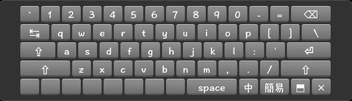
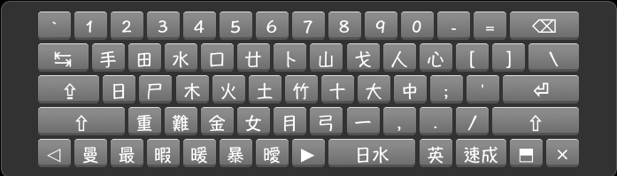
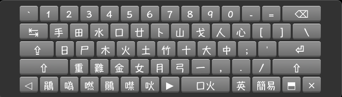
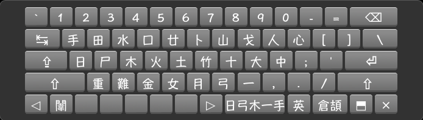
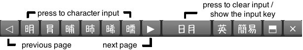

Raspberry Virtual Keyboard with touch screen

## Backup vkeyboard.py
sudo mv /usr/local/lib/python2.7/dist-packages/kivy/uix/vkeyboard.py /usr/local/lib/python2.7/dist-packages/kivy/uix/vkeyboard-org.py

## Installation
cd ~/

git clone https://github.com/ckkung/Kivy-VKeyboard.git

cd Kivy-VKeyboard

sudo cp -r kivy /usr/local/lib/python2.7/dist-packages/

## Active chinese keyboard
nano ~/.kivy/config.ini 

	keyboard_mode = dock
	keyboard_layout = chinese

## English keyboard

## Simplified (速成) Chinese keyboard

## Simplified (簡易五代) Chinese keyboard

## Changjei5 (倉頡五代) Chinese keyboard

## How to use

Press  to change Chinese keybaord

Press  to change English keyboard

Press  /  /  to change another input method

 Changjei5 (倉頡五代) input method

 Simplified (簡易五代) input method

 Simplified (速成) input method

